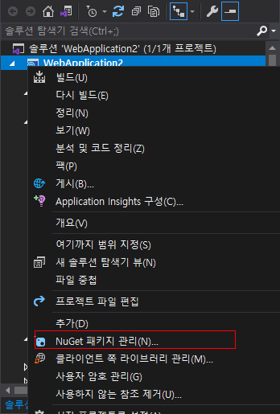
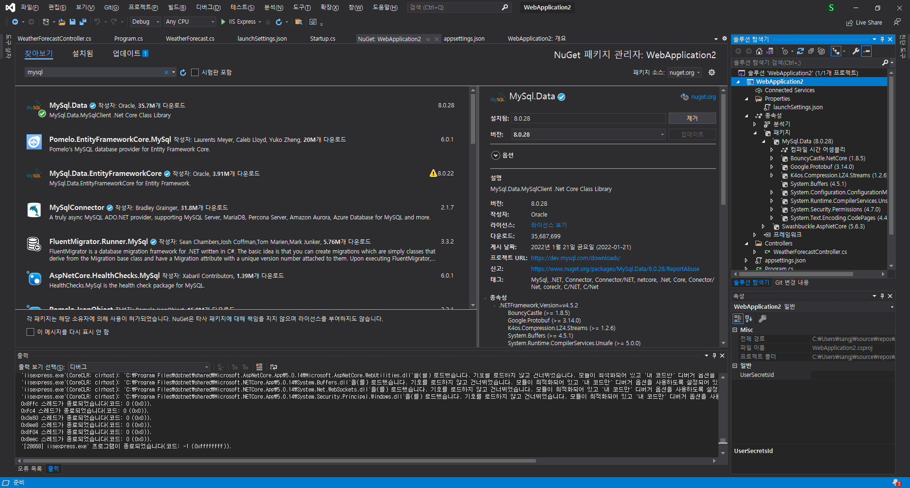

# ASP.NET Core 정리

## NuGet 패키지

솔루션 탐색기에서 프로젝트 우클릭해서 NuGet 패키지 관리를 들어가면 패키지를 찾을 수 있다.

찾아보기 탭에서 필요한 패키지를 설치하면 "프로젝트 - 종속성 - 패키지" 내에 설치가 된 것을 확인할 수 있다.

이제 이 패키지를 가져와서 사용하게 될텐데 using 문을 사용해서 필요한 파일에서 사용하면 된다.

### MySql

## Properties / launchSettings.json

실행 시, 세팅에 대한 내용

어떤 프로필을 사용할지, 어떤 스키마를 가져올지?