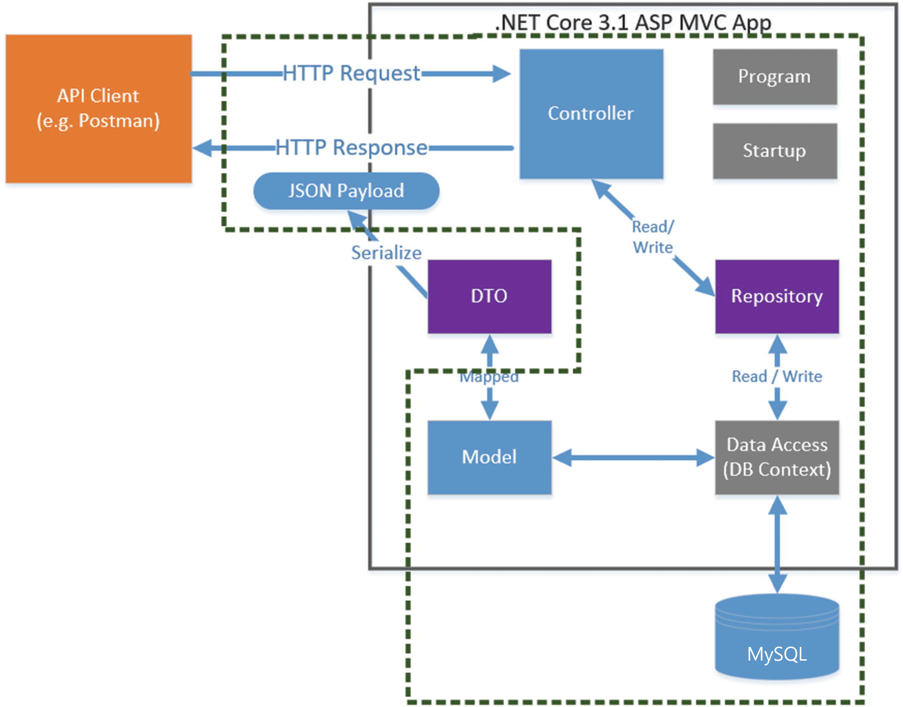

# 백엔드 정리



### MySQL 연결

- 우선 설치할 NuGet Package

  - Pomelo.EntityFrameworkCore.MySql (ver. 5.0.4)
  - Microsoft.EntityFrameworkCore.Tools (ver. 5.0.15)

- appsettings.json 파일 수정

  - ```json
    {
        "ConnectionStrings": {
            "Default": "server=localhost;port=3306;database=[];user=root;password=[pw]"
        },
        "Logging": {
            "LogLevel": {
                "Default": "Information",
                "Microsoft": "Warning",
                "Microsoft.Hosting.Lifetime": "Information"
            }
        },
        "AllowedHosts": "*"
    }
    ```

- Startup.cs 수정

  - ```c#
    public void ConfigureServices(IServiceCollection services)
    {
        var serverVersion = new MySqlServerVersion(new Version(8, 0, 28));
        services.AddDbContext<EFContext>(options => options.UseMySql(Configuration.GetConnectionString("Default"), serverVersion));
    }
    ```

  - 현재 sql 버전에 맞춰서 해야하는 듯하다. 다른 환경에서 세팅할 때 안돌아간다면 버전체크를 해보면 좋을 듯.

  - `GetConnectionString("Default")`에서 `Default`는 위 appsettings.json 파일에서 지정해준 이름이다.

  - `AddDbContext<EFContext>`의 `EFContext`는 data저장해둔 context 명이다.

  


### Models 폴더 생성 및 파일 생성


### Context 폴더 생성 및 파일 생성


### Migration

```
dotnet ef migrations add NewMigration

dotnet ef database update
```


### repository 생성


automapper 패키지

