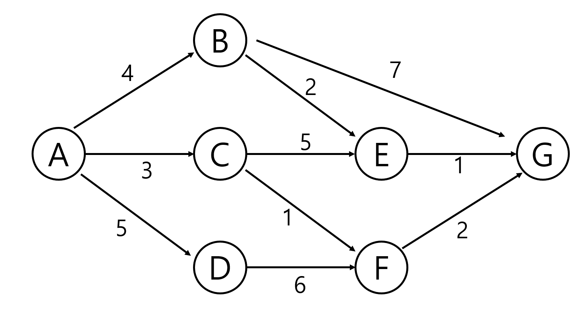
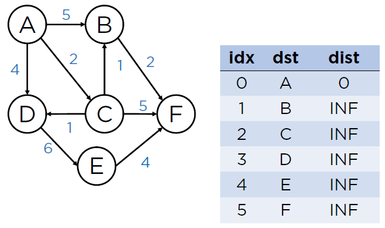

# 최단 경로 알고리즘 - 01

> 가중 그래프에서 간선의 가중치의 합이 최소가 되는 경로를 찾는 문제

## 종류

#### 단일 출발 (single-source) 최단 경로

어떤 하나의 정점에서 출발하여 나머지 모든 정점까지의 최단 경로를 찾는 문제

#### 단일 도착 (single-destination) 최단 경로

모든 정점에서 출발해서 어떤 하나의 정점까지의 최단 경로를 찾는 문제

간선들을 뒤집으면 단일 출발 최단 경로 문제로 바꿀 수 있다.

#### 단일 쌍 (single-pair) 최단 경로

모든 정점 쌍들 사이의 최단 경로를 찾는 문제

## 주요 알고리즘

#### BFS

가중치가 없거나 모든 가중치가 동일한 그래프에서 가장 빠르다.

#### Dijkstra Algorithm

음이 아닌 가중 그래프에서 단일 쌍, 단일 출발, 단일 도착 최단 경로 문제

#### Bellman-Ford-Moore Algorithm

가중 그래프에서 단일 쌍, 단일 출발, 단일 도착 최단 경로 문제

#### Floyd-Warshall Algorithm

전체 쌍 최단 경로 문제


## Dijkstra

기본적으로 DP 개념이 적용된다.

edge의 가중치는 양수만 가능하다. (가중치에 음수가 있을 경우에는 벨만포드나 플로이드 워셜 알고리즘 사용 가능)

### Dijkstra 의 기본 컨셉



부분 경로에서의 최단거리의 집합이라는 명제로 접근.

A에서 E까지 가는 경로 1 : A - B - E / 4 + 2 = 6

A에서 E까지 가는 경로 2 : A - C - E / 3 + 5 = 8


즉, 시작 지점부터 연결되어 있는 노드들을 탐색해서 최단 거리를 업데이트 하는 방식


### Dijkstra 작동 방식



우선순위 큐를 활용. 노드만 넣어주는 것이 아닌 해당 노드의 distance 값도 함께 넣어준다.

1. 시작 지점의 노드 A와 dist = 0 을 큐에 넣어준다.
2. 큐에서 꺼내서, 연결 노드 B의 dist를 기존에 담긴 값과, A에서의 거리 5 중 더 작은 값으로 갱신
3. B와 dist=5를 큐에 넣어준다.
4. A → C, D에 대한 정보도 2, 3과 마찬가지로 큐에 삽입
5. 이 때 우선순위 큐의 우선 순위는 dist 값이 작은 순서다.
6. 따라서 C부터 꺼내서 2,3,4,5의 과정을 반복한다.
7. 큐가 빌때까지 반복해서 각 지점별 최단 거리를 찾아낼 수 있다.

### Dijkstra Code for Python

```python
'''
5 11
0 1 3
0 2 5
1 2 2
1 3 6
2 1 1
2 3 4
2 4 6
3 4 2
3 5 3
4 0 3
4 5 6
'''

def dijkstra(s, V): # 시작정점 s, 마지막 정점 V
    U = [0] * (V+1)
    U[s] = 1
    for v in range(V+1):
        D[v] = adj[s][v]

    #while len(U) != V:
    for _ in range(V):  # V = 정점개수-1과 같으므로..남은 정점개수와 같음
        minV = INF
        w = 0
        for i in range(V+1):
            if U[i]==0 and minV>D[i]:
                minV = D[i]
                w = i
        U[w] = 1  # 선택된 집합에 포함

        for v in range(V+1):   # 정점 v가
            if 0<adj[w][v]<INF:  # w에 인접이면 , 시작정점에서 w를 거쳐 v로 가능 비용과
                D[v] = min(D[v], D[w]+adj[w][v])  # 시작정점에서 v로 가는 기존 비용을 비교 후 선택


INF = 10000
V, E = map(int, input().split())
adj = [[INF]*(V+1) for _ in range(V+1)]
for i in range(V+1):
    adj[i][i] = 0
for _ in range(E):
    u, v, w = map(int, input().split())
    adj[u][v] = w  # 방향성 그래프

D = [0]*(V+1)
dijkstra(0, V)
print(D)  # 시작 정점 0에서 각 정점으로 가는 최소 비용
```


## 출처

https://jina-developer.tistory.com/118

https://mattlee.tistory.com/50