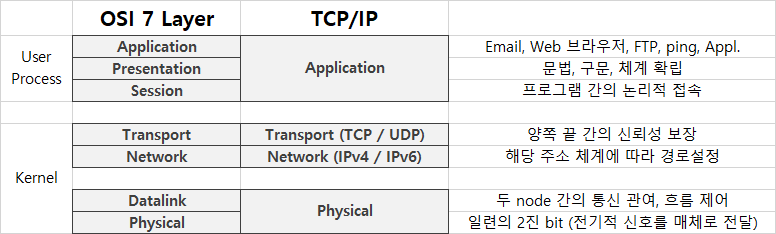
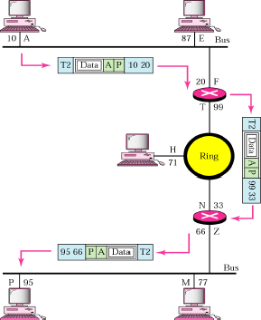
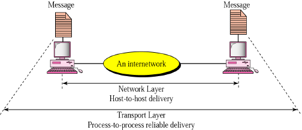
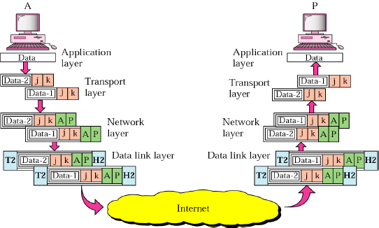
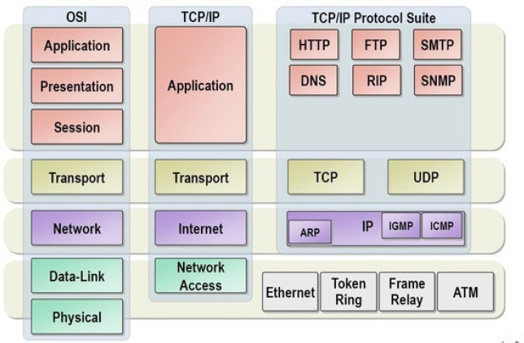

# Ch01. 컴퓨터 네트워크와 인터넷

> FASTCAMPUS 강의 필기

## 차례

- 컴퓨터 네트워크 소개
- 컴퓨터 네트워크와 인터넷
- 네트워크의 계층별 역할
- 물리 계층
- 데이터 링크 계층
- 네트워크 계층
- 전송 계층
- 응용 계층
- Ch01. 정리

## 컴퓨터 네트워크 소개

네트워크를 이루고 있는 각종 구성요소 살펴보기

해당 통신을 위한 규약인 프로토콜들을 하나씩 살펴보기

그 규약을 지키기 위한 각 계층 별 역할을 OSI 7 Layer라고 하는데, 이 이론적인 모델을 이용하기 위해서는 TCP/IP 프로토콜 스택을 채용하고 있다.

Ch01.에서는 간단한 소개를 위주로 진행할 예정이다.

## 컴퓨터 네트워크와 인터넷

### 용어 정리

**네트워크**

종단 시스템 (end system) : PC나 스마트폰 처럼 네트워크 송수신 주체

프로토콜 (Protocol) : 두 이종 시스템을 연결하기 위한 규약

통신을 목적으로 실제 물리적으로 선으로 연결되어 있거나 무선으로 연결된다.

**인터넷**

회사 혹은 소규모의 네트워크에서 전세계 네트워크와 연결된 상태

다양한 애플리케이션 서비스가 제공되고 있다.

종단 시스템은 보통 ISP (Internet Service Provider)에 의해 연결

(인터네트워크, 네트워크를 연결한 상태)

브라우저에서 쓰는 프로토콜은 http

다양한 애플리케이션 프로토콜을 통해 애플리케이션 서비스를 받을 수 있다.

서비스를 제공하는 KT 등등의 ISP에 의해 연결된다.

**OSI 7 Layer**

일종의 이론적인 모델로, 네트워크 구성요소를 7개의 계층으로 역할을 나눈 표준 모델

통신을 위해 서로 약속이 필요하듯이, 그 약속을 상세하게 기술한 모델이라고 할 수 있다.

각 계층별 역할을 통해 통신규격 (프로토콜)을 만족

일부 하위 계층은 하드웨어에서, 상위계층은 소프트웨어로 구현

**TCP/IP (Transmission Control Protocol / Internet Protocol)**

리눅스 때 나옴.

OSI 7 Layer 나오기 전 널리 사용되던 사실 상 표준 역할

각 계층별로 역할이 나뉨

**IP 주소**

통신 자료를 최종적으로 전달하기 위해 필요한 송/수신 위치 정보

보통 IPv4의 주소를 사용하며 주소 부족이 생겨 IPv6가 개발됨

IPv4의 경우 10진법으로 192.168.1.3

**패킷 교환**

패킷 : 인터넷을 위해 주고받는 데이터의 단위 (종단 간에 전송되는 데이터의 단위)

패킷은 네트워크를 통해 일정한 순서 없이 보내지며 어떤 경로를 통해 이동되는지는 네트워크의 상황에 따라 다르다.

A로부터 B로 전달하려면 어디로 갈지 경로를 알아내야 하는데 그런 역할을 하는 것을 패킷 교환이라 한다.

### 통신을 위한 기본 동작

**요청 (Request)** : 전송하는 종단 장치에서 상대방에 서비스를 요청한다.

**인지 (Indicate)** : 수신하는 장치에서 작업 요청 (이벤트)을 확인한다.

**응답 (Response)** : 수신하는 장치에서 요청받은 작업에 대해 적절히 응답한다.

**확인 (Confirm)** : 전송 측에서 응답 데이터를 최종적으로 확인한다.

### 네트워크의 유형

**LAN (Local Area Network)** : 작은 규모로, 집, 사무실, 학교 등을 묶을 수 있는 지역 네트워크. 소규모로 묶이며 사설망 등을 구축해 연결

**WAN (Wid Area Network)** : 원거리 통신망으로 넓은 범위 연결 (국가, 대륙 등)

**크기 유형** : LAN < WAN < Internet

LAN을 묶어 WAN으로 연결, 이 모든 것을 연결한 것을 인터넷이라고 생각하면 된다.

### 네트워크 토폴로지

일종의 네트워크 구성 형태!

**Ring Topology** - 기기 끼리 직접 연결. 회선 설치가 수월하다는 장점이 있지만, 특정 장비가 문제가 있을 때 다른 장비와 통신이 힘들 수 있다.

**Bus Topology** - 하나의 메인 회선을 설치하고, 메인 회선에 기기를 달아두는 형태.

**Star Topology** - 가정에서 많이 볼 수 있는데, 허브 (공유기) 가 있고 그 것을 중심으로 연결해둔 형태

**Mesh Topology** - 가장 빠르고 하나가 끊겨도 문제가 생길 가능성은 적지만, 설치가 복잡하다.

## 네트워크의 계층별 역할

### OSI 7 Layer 와 TCP/IP의 관계 (규약)

네트워크 표준이 제정되기 전에 두루두루 쓰였던 사실 상 표준이었던 TCP/IP 프로토콜 스택.

유닉스나 리눅스에서 사용되던 이 스택을 사용해서 OSI 7 Layer라는 이론적 모델이 만들어졌다.

Kernel : 운영체제 에서 담당 / User Process : 운영단에서 담당

OSI 7 Layer는 이렇게 만들면 좋다 라고 만들어 둔 것.

외우는 방법 : Please Do Not Touch Steve's Pet Alligator.

### 종단 간의 연결

계층이 사용되는 원리

A에서 B로 보내기 위해서 데이터를 생성

A의 Application 계층에 전송

이 데이터를 Transport에서 감싸고 Network에서 주소가 덧붙여진다.

Datalink 에서 하드웨어 주소(mac)을 덧붙이고

Physical Layer를 통과 하면 1과 0으로 이루어진 2진 값으로 만들어진다.

이후 다양한 경로를 파악하기 위해 중간의 Network 계층까지는 탐색한다. (주소를 알기 위해)

최종적으로 B에 도달 되어서 다시 역 방향으로 데이터를 풀어낸다.

## 물리 계층 (Physical Layer)

> 물리적 매체를 통한 비트 스트림 전송에 요구되는 기능을 담당 (기계적, 전기적, 전송매체)
>
> 물리적인 장치와 인터페이스가 전송을 위해 필요한 기능과 처리절차 규정

### 주요 기능

 A Physical Layer → Transmission medium (안테나, 회선 등등) → B Physical Layer 순으로 전송이 이루어질 때

- 인터페이스와 매체의 물리적인 특성 : 장치와 전송매체 간의 인터페이스 특성을 규정
- 비트의 표현 : 비트를 전송하기 위해 전기적 또는 광학적인 신호로 부호화
- 데이터 속도 : 신호가 유지되는 비트의 주기를 규정. 무한정 빠르게 보낼 순 없으니 속도를 맞춰야 한다.
- 비트의 동기화 : 송신자와 수신자는 같은 클록을 사용

### 물리계층을 다루기 위한 하드웨어 칩

물리계층을 다루기 위한 것은 하드웨어 칩에 존재

### 물리계층을 위한 프로토콜

**MAC (Medium Access Control)**

필요한 이유는 전달하고자 하는 양 단에서 2진비트로 보내고 있을 때 상대방이 보내면 충돌이 일어난다.

그래서 회선을 경쟁적으로 쓰는데 이걸 자유경쟁이라하고 여러 알고리즘이 존재 

​	Aloha | Slotted Aloha | CSMA (Carrier Sense Multiple Access) | CSMA/CD (CSMA/Collison Detection)

​	CSMA/CD : 충돌을 감지한 후, 일정시간을 대기했다가 다시 보낼 수 있는 상태로. 최대 16번까지 재시도 가능.

## 데이터 링크 계층 (Datalink Layer)

> 노드 대 노드 전달 (node-to-node delivery)을 담당

### 주요 기능

프레임 구성 : 네트워크 계층으로부터 받은 비트 스트림을 프레임 단위로 나눈다.

상위계층 (Network Layer)에서 내려온 데이터에 헤더로 물리주소 MAC을 추가해서 하위계층 (Physical Layer)에 넘겨준다. (반대로 갈때는 헤더(물리주소)를 떼고 넘겨준다.)

헤더를 붙인 후, "흐름제어 | 오류제어 | 접근제어" 에 필요한 내용을 트레일러 (꼬리)에 덧붙여서 보낸다.

​	흐름제어 : 수신자의 수신 **데이터 전송률을 고려하여 데이터 전송**하도록 제어

​	오류제어 : 손상 또는 손실된 **프레임을 발견/재전송**, 트레일러를 통해 이루어짐

​	접근제어 : 주어진 어느 **한 순간에 하나의 장치만** 동작하도록 제어

### 데이터링크 계층에서 사용하는 주요 프로토콜

**ARP (Address Resolution Protocol)**

주소를 해석하기 위한 프로토콜

논리적인 IP 주소를 물리적인 MAC 주소로 바꾼다.

캐시를 통해 얻은 정보를 저장하고 보통 20분 정도 저장해둔다.

**RARP (Reserve Address Resolution Protocol)**

역 주소 프로토콜

저장 장치가 없는 네트워크 단말기 등이 IP 주소를 얻기 위해 사용된다.

### Node-to-Node (Hop-to-Hop)의 전달

통신을 위한 PC, 라우터 각각 모두 node가 될 수 있고 이 사이 통신을 데이터링크에서 책임

MAC 주소를 통해서 다음 노드가 어딘지 알 수 있다.

Data link → Physical → Hop-to-Hop delivery → Physical → Data link

### 데이터링크 계층의 전달 요소

**물리주소의 데이터 전달 과정**

(물리주소 예시 : 07:01:02:01:2C:4B)

물리주소 `10`인 노드에서 물리주소 `87`인 노드에 프레임을 보낸다고 하자.

- 헤더에는 Source address인 `10`과 Destination address 인 `87`을 가지고 있게 된다.

- 헤더 끝에는 이 수준에서 필요한 다른 정보가 있다.
- 트레일러에는 보통 오류검출을 위한 추가 비트들이 포함되어 있다.

## 네트워크 계층 (Network Layer)

> 발신지 - 대 - 목적지 전달을 담당

### 주요 기능

논리 주소 지정 (Logical addressing) : 상대방이 누군지 IPv4, IPv6 주소체계로 네트워크 레이어의 헤더에 담는다.

라우팅 (Routing) : 패킷이 최종 목적지에 전달될 수 있도록 경로를 지정하거나 교환 가능

### 네트워크 계층의 주요 프로토콜

**ICMP (Internet Control Message Protocol)**

- 에러 발생 시, 그 원인을 알려주거나 네트워크 상태 진단 기능

**IGMP (Internet Group Management Protocol)**

- 특정 피씨가 보내고자하는 그럽구성원을 인접한 라우터에게 알리는 프로토콜

**IP (Internet Protocol)**

- 네트워크 기기에서 논리적 식별을 위한 주소
- 가장 대표적
- IPv4 : 40억 개의 주소 [ex) 123.321.234.232]
- IPv6 : 2¹²⁸ 개의 주소 [ex) 21DA:00D3:0000:2F3B:02AA:00FF:FE28:9C5A]

### 발신지 대 목적지 전달

End System to End System 통신이 가능해짐

### 네트워크 계층의 전달 흐름

데이터를 보내는 주소와 받는 주소가 서로 다른 네트워크에 위치해 있을 때는 링크주소만 사용할 수 없다.

링크 주소는 자기 지역에서만 의미가 있다. 이제 필요로 하는 것은 근거리 통신망의 경계를 지나서도 전송할 수 있는 전역적인 주소인데 네트워크 주소인 IP 주소가 이 역할을 하고 있다.

## 전송 계층 (Transport Layer)

> 프로세스 대 프로세스 전달을 담당 (프로세스 : 앱, 프로그램)
>
> 포트가 필요하게 됨 (어떤 프로그램이 구동되고 있는지 확인한다.)
>
> 프로그램에서 내보내는 메세지는 크기 때문에 잘라서 보내야 하는데 이걸 전송 계층이 담당
> 	잘라진 내용물 : Segments 

### 주요 기능

포트 주소 지정 (port addressing) : 포트 주소를 전송계층 헤더에 포함

​	네트워크 계층은 각 패킷을 정확한 컴퓨터에,

​	전송 계층은 해당 컴퓨터의 정확한 프로세스 (프로그램)에게 전달

분할과 재조립 (Segmentation and Reassembly)

​	전달 가능한 세그먼트 단위로 나눈다.

​	각 세그먼트는 순서 번호를 가지며, 이를 통해 재조립 및 패킷의 손실 여부 판단

연결제어 | 오류제어 | 흐름제어 : 제대로 조립이 안될 수 있기 때문에 추가로 갖고 있다.

### 전송 계층의 프로토콜

**TCP (Transmission Control Protocol)**

- 연결형 서비스로 **가상회선 방식**을 제공 (종단간에 연결을 보장)
- 신뢰성을 보장하며 **3-way handshaking** 과정을 통해 연결 (보장이 되는 과정. 두개의 종단간의 연결을 보장하기 위한 메세지가 왔다갔다 해야해서 속도가 느릴 수 있다.)
- 전이중 (Full-Duplex), 점대점(Point to Point) 방식

**UDP (User Datagram Protocol)**

- 비연결형 서비스로 데이터그램 방식을 제공
- 신뢰성이 낮다.
- TCP 보다 속도가 빠르다.
- 영상의 경우 프레임 몇개 빠져도 보는데에 지장이 없다. 이런 경우에 적합 (멀티미디어 데이터 전송할 때)

**SCTP (Stream Control Transmission Protocol)**

- SCTP는 UDP와 TCP의 특성을 결합
- UDP나 TCP와 유사하며 다중 연결을 지원한다.

경우에 따라 프로토콜을 선택해야한다.

### 전송 계층에서의 전달 흐름

**메시지의 프로세스 대 프로세스 전달**

### 전송 계층의 전달 예시

Transport Layer : 데이터를 쪼개고, 각각 포트번호를 붙인다.

Network Layer : 논리주소 추가

Datalink Layer : 물리주소 추가

## 응용 계층 (Application Layer)

> 사용자가 네트워크에 접근할 수 있도록 해줌
>
> 사용자 인터페이스 제공
>
> 매우 다양한 서비스가 있다. (원격 로그인, 파일 액세스, 전송, 관리, 메일 서비스 등등등등)

### Application 계층의 프로토콜 및 프로그램

FTP (File Transfer Protocol) : 파일 전송 프로토콜

SMTP (Simple Mail Transfer Protocol) : 메일 보내기

DNS (Domain Name System) : 주소를 치면 주소에 해당되는 IP 주소를 얻어오는 프로토콜

HTTP : 웹 브라우저

DHCP : 동적 IP 할당

Ping : 상대방에게 살아있는지? 보내는 거

....등등 매우 많은 프로그램 들이 존재한다.

## 각 계층과 프로토콜 비교

이제 이걸 조합시켜서 프로토콜들을 사용할 수 있다. 애플리케이션을 만들어내도 하위의 프로토콜을 어떤걸 사용할지 결정해야 하기 때문에 세부항목을 알아둘 필요가 있다.

## 최종 정리

- LAN , WAN , Internet
- OSI 7 Layer vs TCP/IP Stack
- 물리계층 - 전기 신호 책임
- 데이터링크계층 - 물리주소 (MAC), 노드 대 노드 책임 , 프레임
- 네트워크 계층 - 논리 (IP) 주소를 통한 발신지-대-목적지 전송 책임, 패킷
- 전송 계층 - 포트 번호를 이용한 ㅡ프로세스-대-프로세스 통신, 세그먼트
- 응용 계층 - 다양한 프로그램 및 프로토콜 존재
