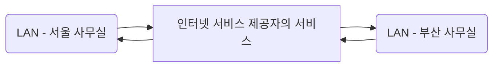

# 1장. 네트워크 첫걸음

> 모두의 네트워크 정리

## 차례

1장. 네트워크 첫걸음

2장. 네트워크 기본 규칙

3장. 물리 계층 : 데이터를 전기 신호로 변환하기

4장. 데이터 링크 계층 : 랜에서 데이터 전송하기

5장. 네트워크 계층 : 목적지에 데이터 전달하기

6장. 전송 계층 : 신뢰할 수 있는 데이터 전송하기

7장. 응용 계층 : 애플리케이션에 데이터 전송하기

8장. 네트워크의 전체 흐름 살펴보기

9장. 무선 랜 이해하기

## Lesson 01. 네트워크의 구조

### 1) 컴퓨터 네트워크란?

**네트워크** : 두 대 이상 연결된 컴퓨터 사이에 필요한 데이터를 주고 받는 구조

네트워크를 사용하여 할 수 있는 것들?

- 컴퓨터에서 다른 컴퓨터로 데이터(파일) 전송
- 웹사이트 열람
- 메일 송.수신

​	등등

인터넷 : 전 세계의 큰 네트워크부터 작은 네트워크까지 연결하는 거대한 네트워크

### 2) 패킷이란?

네트워크나 인터넷에서 데이터를 주고받으려면 **규칙**이 필요하다.

이 규칙에 사용되는 것이 **패킷(packet)**

**패킷** : 컴퓨터 간에 데이터를 주고 받을 때 **네트워크를 통해 전송되는 데이터의 작은 조각**

패킷을 작게 나누는 이유? : 큰 데이터를 그대로 보내면 네트워크의 대역폭을 너무 많이 점유해서 다른 패킷의 흐름을 막을 위험이 있어서

**대역폭(bandwidth)** : 일반적으로 네트워크에서 이용 가능한 최대 전송 속도로 정보를 전송할 수 있는 단위 시간당 전송량을 말한다.

따라서 용량이 큰 데이터는 패킷을 분할해서 전송하게 되는데, 전송 완료된 목적지에서는 이걸 원래 데이터로 되돌리는 작업을 해야한다. 하지만 각 패킷은 네트워크 지연 등의 이유로 늦게 도착하거나 누락되는 패킷이 생기며 최종적으로 목적지에 도착한 패킷은 순서 없이 제각각 도착한다. 따라서 보내기 전에 각 패킷에 순서에 대한 정보를 붙여서 보내게 되고, 받은 이후는 그 순서에 맞춰 다시 나열해서 원래 데이터로 되돌릴 수 있게 된다.

## Lesson 02. 정보의 양을 나타내는 단위

### 1) 비트와 바이트란?

디지털 데이터(digital data) : 모든 컴퓨터는 0과 1만을 다루는데 그 0과 1의 집합을 디지털 데이터라고 한다.

비트(bit) : 디지털 데이터를 나타내는 최소 단위

바이트(byte) : 8비트

문자 코드(character code) : 숫자와 문자의 대응표를 미리 만들어 둔 것.

ASCII : American Standard Code for Information Interchange. 문자 코드 중 하나로 알파벳, 기호, 숫자 등을 다룰 수 있는 기본적인 문자코드.

## Lesson 03. 랜과 왠

### 1) 랜과 왠의 차이

네트워크의 범위에 대한 내용

랜 (LAN) : Local Area Network. 근거리 통신망. 건물 안이나 특정 지역을 범위로 하는 네트워크. 사무실이나 가정과 같이 지리적으로 제한된 곳에서 연결하는 네트워크 (컴퓨터 - 프린터 등)

왠 (WAN) : Wide Area Network. 지리적으로 넓은 범위에 구축된 네트워크. 인터넷 서비스 제공자 (ISP)가 제공하는 서비스를 사용하여 구축된 네트워크. 

랜은 연결 거리가 짧은 만큼 신호가 약해지거나 오류가 발생할 확률이 낮고, 왠은 멀리 떨어져 있는 만큼 신호가 약해지거나 오류가 발생할 확률이 더 높다.

|      | 랜                         | 왠                    |
| ---- | -------------------------- | --------------------- |
| 범위 | 좁다 ( 건물이나 특정 지역) | 넓다 (랜과 랜을 연결) |
| 속도 | 빠르다                     | 느리다                |
| 오류 | 적다                       | 많다                  |

ISP : Internet Service Provider. KT, U+, SK 등

## Lesson 04. 가정에서 하는 랜 구성

### 1) 가정에서의 네트워크 구성

인터넷 서비스 제공자와 인터넷 회선을 결정하고 계약

인터넷 서비스 제공자와 인터넷 공유기로 접속

접속 방식에는 유선 랜 방식과 무선 랜 방식이 있다.

## Lesson 05. 회사에서 하는 랜 구성

### 1) 소규모 회사에서의 네트워크 구성

DMZ : DeMilitarized Zone. 외부에 공개하기 위한 네트워크

외부에 공개하는 서버에는 주로 웹 서버, DNS 서버, 메일 서버가 있다.

회사의 서버는 온프레미스나 클라우드로 운영된다.

각 서버나 컴퓨터는 스위치나 무선 랜 기능을 사용하여 사내 랜에 접속한다.

