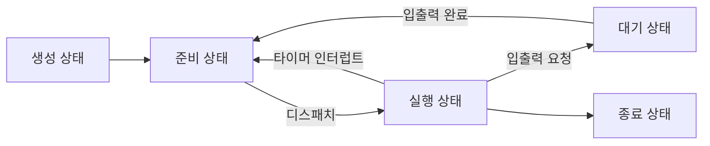

# Ch10. 프로세스와 스레드

> 혼자공부하는 컴퓨터구조 + 운영체제

## 10-1. 프로세스 개요

> 프로세스 관리는 운영체제의 핵심 서비스. 운영체제가 관리하는 프로세스가 무엇인지

### 프로세스 직접 확인하기

**확인 방법**

윈도우 : 작업관리자 - 프로세스 탭

유닉스 : ps 명령어

**포그라운드 프로세스 (foreground process)** : 사용자가 볼 수 있는 공간에서 실행되는 프로세스

**백그라운드 프로세스 (background process)** : 보이지 않는 공간에서 실행되는 프로세스

백그라운드 프로세스 중에는 사용자와 상호작용하지 않고 그저 묵묵히 정해진 일만 수행하는 프로세스가 있는데 유닉스 체계의 운영체제에서는 **데몬(daemon)** /윈도우 운영체제에서는 **서비스(service)**라고 부른다.

### 프로세스 제어 블록 (PCB; Process Control Block)

모든 프로세스는 실행을 위해 CPU를 필요로 하지만 CPU자원은 한정되어 있다.

프로세스들은 돌아가며 한정된 시간만큼만 CPU를 사용하며, 시간이 끝났음을 알리는 인터럽트 (**타이머 인터럽트**)가 발생하면 자신의 차례를 양보하고 다음 차례가 오기를 기다린다.

```
타이머 인터럽트
- 클럭 신호를 발생시키는 장치에 의해 주기적으로 발생하는 하드웨어 인터럽트.
- 타임아웃 인터럽트라고도 한다.
```

운영체제는 빠르게 번갈아가며 수행되는 프로세스의 실행 순서를 관리하고, 프로세스에 CPU를 비롯한 자원을 배분한다. 이를 위해 사용하는 것이 PCB.

#### 프로세스 제어 블록(PCB)이란?

프로세스와 관련된 정보를 저장하는 자료 구조.

각각의 프로세스를 식별하기 위해 꼭 필요한 정보들이 저장된다.

PCB는 커널 영역에 생성된다.

운영체제는 PCB로 특정 프로세스를 식별하고, 해당 프로세스를 처리하는데 필요한 정보를 판단한다.

PCB는 프로세스 생성 시에 만들어지고 실행이 끝나면 폐기된다. 다시 말해 새로운 프로세스가 생성되었다는 말은 운영체제가 PCB를 생성했다는 말과 같고, 프로세스가 종료되었다는 말은 운영체제가 해당 PCB를 폐기했다는 말과 같다.

#### PCB에 담기는 정보

**프로세스 ID (PID; Process ID)**

특정 프로세스를 식별하기 위해 부여하는 고유한 번호. 같은 일을 수행하는 프로그램이라 할지라도 두번 실행하면 PID가 다른 두 개의 프로세스가 생성된다.

**레지스터 값**

프로세스는 자신의 실행 차례가 돌아오면 이전까지 사용했던 레지스터의 중간값들을 모두 복원한다. 그래야 이전까지 진행했던 작업들을 그대로 이어 실행할 수 있다. 

**프로세스 상태**

입출력장치를 사용하기위해 기다리고 있는 상태인지, CPU를 사용하기 위해 기다리고 있는 상태인지, CPU 를 사용하고 있는 상태인지 등 프로세스 상태 정보도 저장된다.

**CPU 스케줄링 정보**

프로세스가 언제 어떤 순서로 CPU를 할당 받을지에 대한 정보도 기록.

**메모리 관리 정보**

프로레스마다 메모리에 저장된 위치가 다르고, 그 주소에 대한 정보가 필요.

페이지 테이블 (프로세스의 메모리 주소를 알 수 있는 정보 중 하나) 정보를 PCB에 담아 확인한다. (14장)

**사용한 파일과 입출력장치 목록**

프로세스 실행과정 중 사용한 입출력장치나 파일에 대한 내용이 PCB에 명시된다.

### 문맥 교환

**문맥(Context)** : 하나의 프로세스 수행을 **재개**하기 위해 기억해야 할 정보.

**문맥 교환 (Context Switching)** : 기존 프로세스의 문맥을 PCB에 백업하고, 새로운 프로세스를 실행하기 위한 문맥을 PCB로부터 복구하여 새로운 프로세스를 실행하는 것.

문맥 교환은 여러 프로세스가 끊임없이 빠르게 번갈아가며 실행되는 원리.

### 프로세스의 메모리 영역

프로세스가 생성되면 커널 영역에 PCB가 생성된다. 

그렇다면 사용자 영역에는 프로세스가 어떻게 배치될까?

하나의 프로세스는 사용자 영역에 크게 `코드 영역`, `데이터 영역`, `힙 영역`, `스택 영역`으로 나뉘어 저장된다.

#### 코드 영역 (code segment)

텍스트 영역(text segment)라고도 함.

실행할 수 있는 코드, 즉 기계어로 이루어진 명령어 저장.

데이터가 아닌 CPU가 실행할 명령어가 담겨 있기 때문에 쓰기가 금지된다. (read-only)

#### 데이터 영역 (data segment)

잠깐 썼다가 없앨 데이터가 아닌, 프로그램이 실행되는 동안 유지할 데이터가 저장되는 공간.

데이터 영역에 저장되는 대표적인 데이터 : **전역 변수**

```
코드 영역과 데이터 영역은 그 크기가 변하지 않는다. = 정적 할당 영역
힙 영역과 스택 영역은 프로세스 실행 과정에서 그 크기가 변할 수 있는 영역 = 동적 할당 영역
```

#### 힙 영역 (heap segment)

프로그래머가 직접 할당할 수 있는 저장 공간.

힙 영역에 메모리 공간을 할당했다면 언젠가는 해당 공간을 **반환**해야 하는데, 이 반환의 의미는 "더 이상 해당 메모리 공간을 사용하지 않겠다."라고 운영체제에 말해주는 것과 같다.

메모리 공간을 **반환**하지 않는다면 할당한 공간은 메모리 내에 계속 남아 메모리 낭비를 초래하고 이런 문제를 **메모리 누수(memory leak)**라고 한다.

#### 스택 영역

데이터를 일시적으로 저장하는 공간.

데이터 영역에 담기는 값과는 달리, 잠깐 쓰다가 말 값들이 저장되는 공간.

함수의 실행이 끝나면 사라지는 매개 변수, 지역 변수가 대표적.

```
일반적으로 힙 영역은 메모리의 낮은 주소에 높은 주소로 할당되고
스택 영역은 메모리의 높은 주소에서 낮은 주소로 할당되어
두 영역에 데이터가 쌓여도 새롭게 할당되는 주소가 겹칠 일이 없다.
```


## 10-2. 프로세스 상태와 계층 구조

프로세스는 모두 저마다의 **상태**가 있고, 운영체제는 이런 상태를 PCB에 기록하여 관리한다.

많은 운영체제는 동시에 실행되는 수많은 프로세스를 **계층적으로 관리**한다.

### 프로세스 상태

여러 프로세스들은 빠르게 번갈아가면서 실행되고, 이 과정에서 하나의 프로세스는 여러 상태를 거친다.




#### 생성 상태 (new)

프로세스를 생성 중인 상태. 이제 막 메모리에 적재되어 PCB를 할당받은 상태.

생성 상태를 거쳐 실행할 준비가 완료된 프로세스는 곧바로 실행되지 않고 준비 상태가 되어 CPU의 할당을 기다림

#### 준비 상태 (ready)

CPU를 할당받아 실행할 수 있지만, 자신의 차례가 아니기에 기다리고 있는 상태.

준비 상태 프로세스는 차례가 되면 CPU를 할당받아 실행 상태가 되는데, 이 전환을 디스패치 (dispatch)라고 한다.

#### 실행 상태 (running)

CPU를 할당받아 실행 중인 상태. 실행 상태인 프로세스는 할당된 일정 시간 동안만 CPU를 사용할 수 있다. 이 때 프로세스가 할당딘 시간을 모두 사용한다면 (타이머 인터럽트가 발생하면) 다시 준비 상태가 되고, 실행 도중 입출력장치를 사용하여 입출력 장치의 작업이 끝날 때까지 기다려야 한다면 대기 상태가 된다.

#### 대기 상태 (blocked)

프로세스는 실행 도중 입출력장치를 사용하는 경우가 있다. 입출력 작업은 CPU에 비해 처리 속도가 느리기에, 입출력 작업을 요청한 프로세스는 입출력 장치가 입출력을 끝낼 때까지 (입출력 완료 인터럽트를 받을 때까지) 기다려야 한다. 이렇게 입출력 장치의 작업을 기다리는 상태를 대기 상태라고 하고, 입출력 작업이 완료되면 해당 프로세스는 다시 준비 상태로 CPU 할당을 기다린다.

#### 종료 상태 (terminated)

프로세스가 종료된 상태. 운영체제는 PCB와 프로세스가 사용한 메모리를 정리한다.


## 10-3. 스레드

