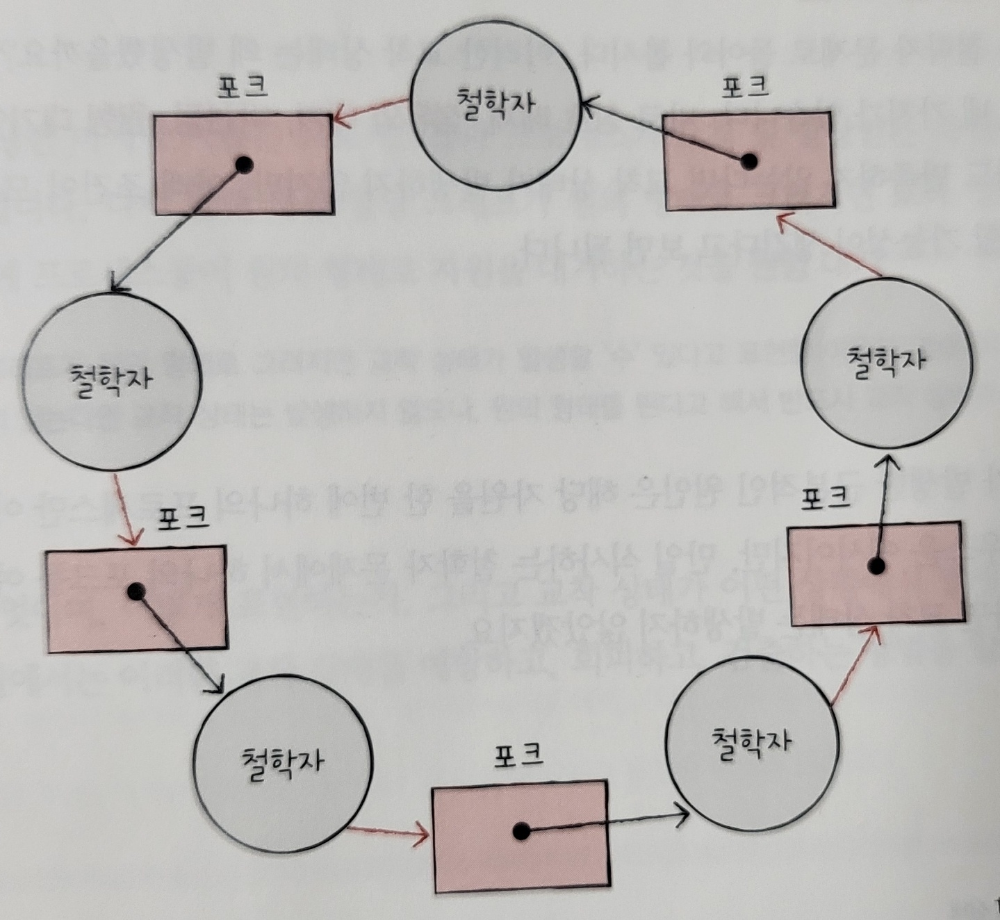

# Ch13. 교착 상태

> 혼자공부하는 컴퓨터구조 + 운영체제

## 13-1. 교착 상태란

> 교착 상태를 해결하는 것 또한 운영체제의 중요한 역할! 그 정의와 원인을 예시를 통해 확인!

두 개 이상의 프로세스가 각자 가지고 있는 자원을 무작정 기다린다면 그 어떤 프로세스도 더 이상 진행할 수 없는 교착 상태가 된다. 이런 교착 상태는 정확히 무엇이고, 언제 어떻게 발생하는지 알아본다.

### 식사하는 철학자 문제 (dining philosophers problem)

교착 상태가 어떤 상황에서 왜 발생하는지, 나아가 어떻게 해결할 수 있는지를 엿볼 수 있는 가상의 시나리오

```
동그란 원탁에 철학자들이 앉아있고, 철학자들 앞에는 맛있는 식사가 있다.
이 식사 사이에는 포크가 1개씩 놓여있는데, 철학자들은 두개의 포크가 있어야 식사를 할 수 있다.

철학자들은 아래의 순서로 식사를 한다.
1) 계속 생각을 하다가 왼쪽 포크가 사용 가능하면 집어든다.
2) 계속 생각을 하다가 오른쪽 포크가 사용 가능하면 집어든다.
3) 왼쪽과 오른쪽 포크를 모두 집어들면 정해진 시간동안 식사를 한다.
4) 식사 시간이 끝나면 오른쪽 포크를 내려 놓는다.
5) 오른쪽 포크를 내려놓은 뒤 왼쪽 포크를 내려놓는다.
6) 다시 1번부터 반복한다.
```

언뜻 보면 식사에는 아무런 문제가 없지만, 모든 철학자가 동시에 포크를 집어 식사를 하면 어떤 철학자도 식사를 할 수가 없고 영원히 생각만 하는 상황이 발생할 수 있다.

이렇게 일어나지 않을 사건을 기다리며 진행이 멈춰버리는 현상을 **교착 상태 (deadlock)** 이라고 한다.

식사하는 철학자 문제에서 철학자는 프로세스 or 스레드, 포크는 자원, 생각하는 행위는 자원을 기다리는 것이 빗대어 볼 수 있다. 또한 포크는 한번에 한 철학자만 사용할 수 있으니 임계 구역이라고 볼 수 있다.

```
임계 구역 : 공유 자원에 접근하는 코드 중 동시에 실행하면 문제가 발생하는 코드 영역을 의미. 임계 구역에 진입한 프로세스가 있다면 다른 프로세스는 임계 구역 밖에서 기다려야 한다.
```

교착 상태는 아주 다양한 상황에서 발생하고, 앞선 장에서 배운 뮤텍스락에서도 발생할 수 있다.

```
프로세스A는 임계 구역 진입 전 lock1 잠그고
프로세스B는 임계 구역 진입 전 lock2 잠그고
프로세스A는 lock2가 false 되길 기다리고
프로세스B는 lock1이 false 되길 기다린다면
교착 상태 발생!
```


### 자원 할당 그래프 (resource-allocation graph)

```
첫째. 프로세스는 원으로, 자원의 종류는 사각형으로 표현
둘째. 사용할 수 있는 자원의 개수는 자원 사각형 내에 점으로 표현
셋째. 프로세스가 어떤 자원을 할당받아 사용 중이라면 자원(점)에서 프로세스를 향해 화살표를 표시한다.
넷째. 프로세스가 어떤 자원을 기다리고 있다면 프로세스에서 자원(사각형)으로 화살표를 표시한다.
```



**교착 상태가 일어난 그래프의 특징!**

자원 할당 그래프가 원의 형태를 띄고 있다.


### 교착 상태 발생 조건

**상호 배제 / 점유와 대기 / 비선점 / 원형 대기**

위 4가지 조건 중 하나라도 만족하지 않는다면 교착 상태가 발생하지 않지만, 위 조건이 모두 만족될 때 교착 상태가 발생할 가능성이 생긴다고 보면 된다.

#### 상호 배제

교착 상태가 발생한 근본적인 원인은 해당 자원을 한 번에 하나의 프로세스만 이용 가능했기 때문. 한 프로세스가 사용하는 자원을 다른 프로세스가 사용할 수 없을 때 즉, 상호 배제 상황에서 교착 상태가 발생할 수 있다.

#### 점유와 대기

자원을 보유한 채 다른 자원을 기다렸기 때문에 문제 발생. 이렇게 자원을 할당받은 상태에서 다른 자원을 할당 받기를 기다리는 상태를 **점유와 대기 (hold and wait)**라고 한다.

#### 비선점

철학자 문제에서 만일 누군가가 다른 철학자의 포크를 강제로 빼앗을 수 있었다면 교착 상태는 발생하지 않았을 것. 이렇게 교착 상태가 발생하게 된 또 하나의 근본적인 문제는 프로세스가 자원을 **비선점(nonpreemptive)** 하고 있었기 때문

#### 원형 대기

프로세스들과 요청 및 할당 받은 자원이 원의 형태를 이루었기 때문. 이런 형태로 대기하는 것을 **원형 대기 (circular wait)** 라고 한다.


## 13-2. 교착 상태 해결 방법

> 운영체제가 교착 상태를 회피 / 예방 / 검출 후 회복 하는 방법

### 교착 상태 예방

위 발생 조건 4가지 중 하나를 충족하지 못하게 하는 방법과 같다.

**상호 배제 없애기**

= 모든 자원을 공유 가능하게 만든다는 말과 같다. 교착상태는 없앨 수 있으나 모든 자원의 상호 배제를 없앨 수는 없으니, 현실적으로 무리

**점유와 대기 없애기**

= 점유와 대기를 없애면 운영체제는 특정 프로세스에 자원을 모두 할당하거나 아예 할당하지 않는 방식으로 배분한다. 이론적으로는 교착상태를 해결할 수는 있지만, 자원의 활용률이 낮아지는 단점이 있다.

사용하지 않으면서 자원을 갖고 있거나, 당장 사용해야하는데 기다릴 수 밖에 없는 현상이 나타날 수 있어 자원의 활용률이 낮아진다.

**비선점 없애기**

= 자원을 이용 중인 프로세스로부터 해당 자원을 빼앗을 수 있다. 이 방식은 선점하여 사용할 수 있는 일부 자원에 대해서는 효과적.

하지만 모든 자원이 선점 가능한 것은 아니며, 한 프로세스의 작업이 끝날때까지 기다려야하는 자원도 얼마든지 있다. 예를 들면 프린터 자원을 도중에 빼앗아 사용할 수 없는 것과 같다. 따라서 다소 범용성이 떨어지는 방안.

**원형 대기 조건 없애기**

= 모든 자원에 번호를 붙이고, 오름차순으로 자원을 할당하면 원형 대기는 발생하지 않는다.

위 세가지 방식에 비하면 현실적이고 실용적이지만, 여전히 단점은 있다. 모든 컴퓨터 시스템 내에 존재하는 수많은 자원에 번호를 붙이는 일은 그리 간단한 작업이 아닐 뿐더러 각 자원에 어떤 번호를 붙이는지에 따라 특정 자원의 활용률이 떨어질 수 있다.

이렇듯 예방은 교착 상태가 발생하지 않음을 보장할 순 있지만 여러 부작용이 존재하게 된다.

### 교착 상태 회피

안전 상태를 유지할 수 있는 경우에만 자원을 할당하는 방법

교착 상태가 발생하지 않을 정도로만 조심 조심 자원을 할당하는 방식.  ("교착 상태 = 한정된 자원의 무분별한 할당으로 인해 발생하는 문제" 로 간주)

프로세스들에 할당할 수 있는 자원이 충분한 상황에서 프로세스들이 한두 개의 적은 자원만을 요구한다면 교착 상태는 발생하지 않는다.

프로세스들에 할당할 수 있는 자원이 한정된 상황에서 프로세스들이 한 번에 많은 자원을 요구하면 교착 상태가 발생할 위험이 증가한다.

그렇기 때문에 프로세스들에 배분할 수 있는 자원의 양을 고려하여 교착 상태가 발생하지 않을 정도의 양만큼만 자원을 배분하는 방법이 교착 상태 회피!!

**안전 상태 (safe state)** : 교착 상태가 발생하지 않고 모든 프로세스가 정상적으로 자원을 할당받고 종료될 수 있는 상태

**불안전 상태 (unsafe state)** : 교착 상태가 발생할 수도 있는 상황

**안전 순서열 (safe sequence)** : 교착 상태 없이 안전하게 프로세스들에 자원을 할당할 수 있는 순서를 의미


안전 순서열이 존재하는지 안하는지에 대한 예시

```
<예시 1>
프로세스	요구량		현재 사용량
P1			10			5
P2			4			2
P3			9			2
total					9
할당 가능 자원 : 12 / 남은 자원 : 3
```

P2에 남은 자원 중 2개 할당 -> P2 종료 후, 남은 자원 5개를 P1에 할당 -> P1 종료 후, 남은 자원 10개 중 7개를 P3에 할당

안전 순서열 P2 -> P1 -> P3 존재

```
<예시 2>
프로세스	요구량		현재 사용량
P1			10			5
P2			4			2
P3			9			3
total					10
할당 가능 자원 : 12 / 남은 자원 : 2
```

P2에 남은 자원 2개 할당 -> P2 종료 후, 남은 자원 4개인데 어디에 넣어도 종료할 수 있는 프로세스 X

안전 순서열 미존재


즉, 운영체제가 교착 상태를 회피하기 위해서는 시스템 상태가 안전 상태에서 안전 상태로 움직이는 경우에만 자원을 할당하면 된다.

교착 상태 회피 방식 = 항시 안전 상태를 유지하도록 자원을 할당하는 방식


### 교착 상태 검출 후 회복

교착 상태 발생 여부를 주기적으로 검사하고, 교착 상태가 발생하면 그때그때 회복하는 방식.

교착 상태 발생을 인정하고 사후에 조치하는 방식.

운영체제는 프로세스들이 자원을 요구할 때마다 그때그때 모두 할당하며, 교착 상태 발생 여부를 주기적으로 검사하고 검출되면 다음 방식으로 회복함.

**선점을 통한 회복**

교착 상태가 해결될 때까지 한 프로세스씩 자원을 몰아주는 방식.

해결될때까지 다른 프로세스로부터 자원을 강제로 빼앗고 한 프로세스에 할당하는 방식이다.

**프로세스 강제 종료를 통한 회복**

교착 상태에 놓인 프로세스를 모두 강제종료 : 가장 확실한 방법이지만 그만큼 많은 프로세스들이 작업 내역을 잃게 될 가능성이 있다.

교착 상태가 없어질 때까지 한 프로세스씩 강제종료 : 작업 내역을 잃는 프로세스는 최대한 줄일 수 있지만 교착 상태가 없어졌는지 여부를 확인하는 과정에서 오버헤드를 야기


## 마치며..

교착상태를 아예 무시하는 방법도 있다.

드물게 발생하는 잠재적 문제를 무시로 대처하는 방식으로 **타조 알고리즘 (ostrich algorithm)**이라고 한다. 문제 발생의 빈도나 심각성에 따라 최대 효율을 추구하는 엔지니어 입장에서는 때때로 이 방식이 적합할 때도 많다.
