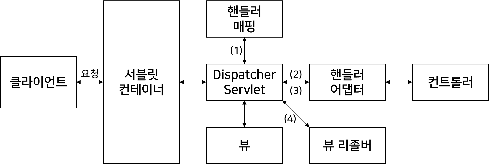

# 02. 개발에 앞서 알면 좋은 기초 지식

> 애프리케이션이 어떻게 동작하는지, 왜 이렇게 구성되는지

## 2.1 서버 간 통신

마이크로서비스 아키텍쳐 (MSA; Microservice Architecture) 는 서비스 규모를 작게 나누어 구성한 아키텍쳐이다.

각 서비스 기능 별로 개발하게 되면 각 서비스 간에 통신해야 하는 경우가 발생한다.

가장 많이 적용되는 방식은 HTTP/HTTPS 방식.


## 2.2 스프링 부트의 동작 방식

### 서블릿 (Servlet)

> https://coding-factory.tistory.com/742

Dynamic Web Page를 만들 때 사용되는 자바 기반의 웹 애플리케이션 프로그래밍 기술로, 웹 요청과 응답의 흐름을 간단한 메서드 호출만으로 체계적으로 다룰 수 있게 해주는 기술

1) 서블릿 소스 작성
2) 컴파일 된 자바 클래스를 서블릿 컨테이너에 등록
3) 컨테이너에서는 서블릿 인스턴스를 생성 후 실행되다가
4) 클라이언트에서 서버로 요청하면
5) 요청에 맞는 동작을 수행하고 웹 브라우저에 HTTP 형식으로 응답

#### 서블릿의 주요 특징

- 클라이언트의 Request에 대해 동적으로 작동하는 웹 애플리케이션 컴포넌트
- HTML을 사용하여 Response
- JAVA의 스레드를 이용하여 동작
- MVC패턴에서의 컨트롤러로 이용
- HTTP 프로토콜 서비스를 지원하는 `javax.servlet.http.HttpServlet 클래스`를 상속 받는다.
- UDP 보다 속도가 느리다.
- HTML 변경 시 Servlet을 재 컴파일해야 하는 단점이 있다.

### 서블릿 컨테이너

서블릿을 담고 관리해주는 컨테이너. 구현되어 있는 서블릿 클래스의 규칙에 맞게 서블릿을 관리해주며 클라이언트에서 요청을 하면 `HttpServletRequest`, `HttpServletResponse` 두 객체를 생성하며 post, get 여부에 따라 동적인 페이지를 생성하여 응답을 보내준다.

```
[HttpServletRequest]
http 프로토콜의 request 정보를 서블릿에게 전달하기 위한 목적으로 사용
헤더 정보, 파라미터, 쿠키, URI, URL 등의 정보를 읽어들이는 메서드와 Body의 Stream을 읽어들이는 메서드를 가지고 있다.

[HttpServletResponse]
WAS는 어떤 클라이언트가 요청을 보냈는지 알고 있고, 해당 클라이언트에게 응답을 보내기 위한 HttpServletResponse 객체를 생성하여
서블릿에게 전달하고 이 객체를 활용하여 content type, 응답 코드, 응답 메시지 등을 전송
```

#### 서블릿 컨테이너의 주요 기능

- 서블릿의 생명주기 관리

  서블릿 컨테이너가 기동되는 순간 서블릿 클래스를 로딩해서 인스턴스화 하고 초기화 메서드를 호출하고 요청이 들이오면 적절한 서블릿 메서드를 찾아서 동작. 그리고 서블릿의 생명이 다하는 순간 가비지 컬렉션을 통해 메모리에서 제거. 서블릿 객체는 싱글톤 패턴으로 관리

  - 싱글톤 패턴 : 객체의 인스턴스가 오직 1개만 생성되는 패턴. 메모리 측면의 이점 + 데이터 공유가 쉽다.

- 통신 지원

  클라이언트의 Request를 받아주고 Response를 보낼 수 있게 웹 서버와 소켓을 만들어서 통신을 해준다.

  통신을 할 때 "소켓을 만들고, 특정 포트를 리스닝하고, 연결 요청이 들어오면 스트림을 생성해서 요청을 받는" 이 과정을 서블릿 컨테이너가 대신하게 된다.

  서블릿 컨테이너는 이렇게 소켓을 만들고 listen, accept 등의 기능을 API로 제공하여  복잡한 과정을 생략할 수 있게 해주고 개발자로서 비즈니스 로직에 더욱 집중할 수 있게 만들어준다.

- 멀티스레딩 관리

  서블릿 컨테이너는 해당 서블릿의 요청이 들어오면 스레드를 생성해서 작업을 수행. 그렇기에 동시에 여러 요청이 들어와도 멀티스레딩 환경으로 동시 다발적인 작업을 관리할 수 있다. 또한 이렇게 한번 메모리에 올라간 스레드는 다시 생성할 필요가 없기에 메모리 관리에 효율적

- 선언적인 보안관리

  보안 관련된 기능을 제공하기 때문에 서블릿 또는 자바 클래스 안에 보안 관련된 메서드를 구현하지 않아도 된다. 대체적으로 보안관리는 XML 배포 서술자에 기록하기 때문에 보안이슈로 소스를 수정할 일이 생겨도 자바 소스 코드를 수정하여 다시 컴파일하지 않아도 된다.

### 서블릿의 동작과정

1. Servlet Request, Servlet Response 객체를 생성
2. 설정 파일을 참고하여 매핑할 Servlet 을 확인
3. 해당 서블릿 인스턴스 존재의 유무를 확인하여 없으면 init() 메소드를 호출하여 생성
4. Servlet Container에 스레드를 생성하고 service() 를 실행
5. 응답을 처리하였으면 destroy() 메소드를 실행하여 Servlet Request, Servlet Response 객체를 소멸


spring-boot-starter-web 모듈을 사용하면 기본적으로 톰캣을 사용하는 스프링 MVC 구조를 기반으로 동작한다.

일반적인 웹 요청이 들어왔을 때의 스프링 부트의 동작구조는 아래와 같다.



###  DispatcherServlet

스프링에서는 DispatcherServlet이 서블릿의 역할을 수행.

일반적으로 스프링은 톰캣을 임베드(embed)해 사용한다. 그렇기 때문에 서블릿 컨테이너와 DispatcherServlet은 자동설정된 web.xml 의 설정값을 공유한다.

(1) DispatcherServlet으로 요청이 들어오면 핸들러 매핑을 통해 요청 URI에 매핑된 핸들러를 탐색. 여기서 핸들러는 컨트롤러

​	핸들러 매핑은 요청 정보를 기준으로 어떤 컨트롤러를 사용할지 선정하는 인터페이스
​	여러 구현체를 가지며 대표적인 구현체 클래스는 다음과 같다.
​	`BeanNameUrlHandlerMapping` : 빈 이름을 URL로 사용하는 매핑 전략. 빈을 정의할 때 슬래시('/')가 들어가면 매핑 대상이 된다. [예) `Bean("/hello")`]
​	`ControllerClassNameHandlerMapping` : 

(2) 핸들러 어댑터로 컨트롤러를 호출

(3) 핸들러 어댑터에 컨트롤러의 응답이 돌아오 면 ModelAndView로 응답을 가공해 반환

(4) 뷰 형식으로 리턴하는 컨트롤러를 사용할 때는 뷰 리졸버를 통해 뷰를 받아 리턴


## 2.3 레이어드 아키텍처


## 2.4 디자인 패턴


## 2.5 REST API


