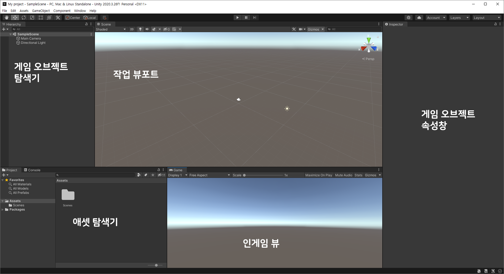
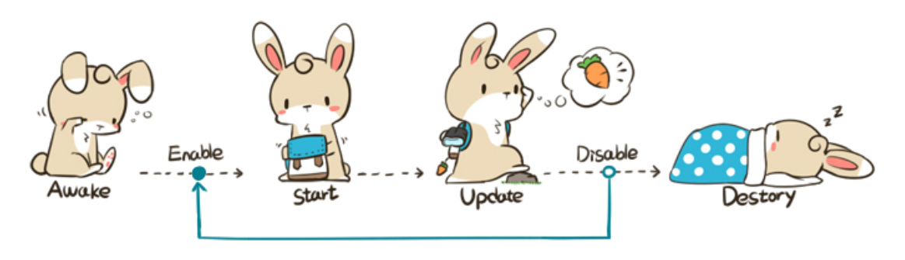

# Unity 01

> 유니티를 다루기 위한 기초적인 정리

## Interface & view



**작업 뷰포트**

게임 오브젝트를 선택하고 수정할 수 있는 공간. 쉽게 말하면 개발 공간.

**인게임 뷰**

실제 게임 상으로 보여지는 공간. 카메라 오브젝트가 최소 하나가 있어야 한다.

**게임 오브젝트 탐색기**

현재 게임 씬(Scene)에 올라온 오브젝트를 정렬해놓은 공간

**에셋 탐색기**

각종 에셋들을 정렬해놓은 공간

**게임 오브젝트 속성창**

선택한 게임 오브젝트의 속성을 설정하는 공간


## 오브젝트 변형

오브젝트 탐색기에서 원하는 오브젝트를 선택하고, 속성창에서 변경할 수 있다.

속성창에서 수치를 변경할 수도 있고, 작업 뷰포트에서 "기즈모(Gizmo)"를 직접 마우스로 끌면서 변형시킬 수도 있다.

`Gizmo : x,y,z 축으로 표시된 축 등으로 빨간색 파란색 초록색으로 표시해주는 영역`

오브젝트의 위치를 이동시키거나 로테이션 등을 단축키와 기즈모로 간단하게 사용할 수 있는데, 그 단축키는 q, w, e, r (시야, 오브젝트 이동, 오브젝트 회전, 오브젝트 스케일) 순서이다.


## 중력과 충돌

유니티에서 중력의 영향을 받는 오브젝트를 만들기 위해서는 Mesh, Collider, Rigidbody가 꼭 필요하다.

### Collider

콜라이더는 연두색 경계선으로 나타나며, 여러가지 형태로 만들 수 있다.

오브젝트 끼리 충돌이 일어나는 기준이 되기 때문에 콜라이더의 크기에 따라서 충돌이 다르게 일어날 수 있다.

**Is Trigger**

해당 콜라이더는 충돌이 아닌 오직 트리거로만 사용하겠다는 옵션.

Is Trigger가 On 되어 있는 콜라이더만 있는 물체는 충돌이 일어나지 않고, 오브젝트를 통과하여 바닥으로 떨어지게 된다.

### 중력 설정

Edit - Project Settings - Physics

Gravity Y -9.81 : 실제 중력가속도가 9.8로 아래로 향하는 설정.

이 수치를 높일수록 물체는 아래로 더 빠르게 떨어지고, 방향을 바꾸는 것도 가능하다.

### Rigidbody

물리 효과를 나타내는 요소로 다양한 옵션이 있다.

**Mass** : 무게. 높을수록 충돌이 무거워지지만, 자유낙하가 빨라지지는 않는다.

**Drag** : 낙하 저항. 높을수록 천천히 낙하한다.

**Angular Drag** : 회전 저항, 높을수록 천천히 회전한다.

**Is Kinematic** : 외부 물리 효과의 영향을 받는지의 여부. 옵션을 켜면 오직 애니메이션, 스크립트에 의해서만 움직이게 된다.

**Interpolation** : 고정 프레임에서 물리 효과를 부드럽게 할 수 있다. 일반적으로 플레이어 캐릭터에 적용.

**Collision Detection** : 연속 충돌 감지 옵션. 상당히 빠른 물체가 미처 다른 물체를 충돌하지 않고 통과해버리는 현상을 방지.

**Constraints** : 위치나 회전을 고정시키는 옵션. 점프하는 플레이어 캐릭터를 이를 활용해서 넘어지지 않게 잡아줄 수 있다.


## Life Cycle

> 프로그래밍에 들어가기 위한 준비 운동

오브젝트를 선택하고, Add Component - New Script 선택.

언어는 C# 과 JavaScript 둘 중 하나를 선택할 수 있지만, 유니티에서는 C#을 권장하고 있다.

새 스크립트를 만들면, 애셋 탐색기에 같은 이름의 C# 파일이 생성된다.

```c#
// 첫 스크립트 생성 시, C# 코드
using System.Collections;
using System.Collections.Generic;
using UnityEngine;

public class NewBehaviourScript : MonoBehaviour
{
    // Start is called before the first frame update
    void Start()
    {
        
    }

    // Update is called once per frame
    void Update()
    {
        
    }
}

```

기본적으로 게임 오브젝트는 MonoBehaviour 클래스로 시작한다.

그리고 이것은 Life Cycle이라는 특징을 가지고 있는데, 우리는 이 사이클에 맞춰서 프로그래밍을 해야 한다.



> 출처 : 골드메탈 블로그 / [유니티 기초] 4. 라이프 사이클

Life Cycle을 구성하는 함수는 매우 많지만, 기본적이고 역할이 큰 함수 중심으로 다뤄보면,

**1. Awake**

최초로 로딩될 때 단 한번 실행. 여러 기본 값을 설정하는 곳.

**2. Enable**

오브젝트가 켜질 때 실행. 여러 번 실행 가능.

**3. Start**

Update 사이클 진입 전 실행. 여러 기본 값을 설정하는 곳.

Awake 와는 다르게 여러 번 실행 가능.

**4-1. Update**

하나의 프레임마다 실행. 주요 로직을 두는 곳. 최대 1초 당 60프레임까지 실행. (프레임이 1초에 70번이라도 60번만)

**4-2. Fixed Update**

하나의 고정 프레임마다 실행. 물리, 리지드바디에 대한 로직을 두는 곳.

정확한 물리 시뮬레이팅을 위해 사용. 높은 CPU 부하 유발.

**5. Disable**

오브젝트가 꺼질 때 실행. 여러 번 실행 가능.

**6. Destory**

오브젝트에 Destory (삭제) 명령이 내려지거나, Scene이 바뀔 때 실행.