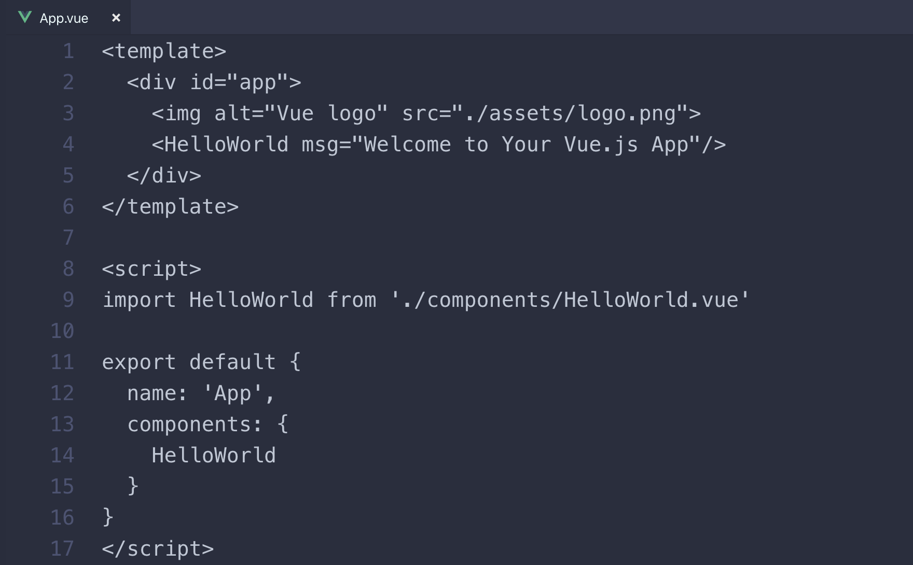
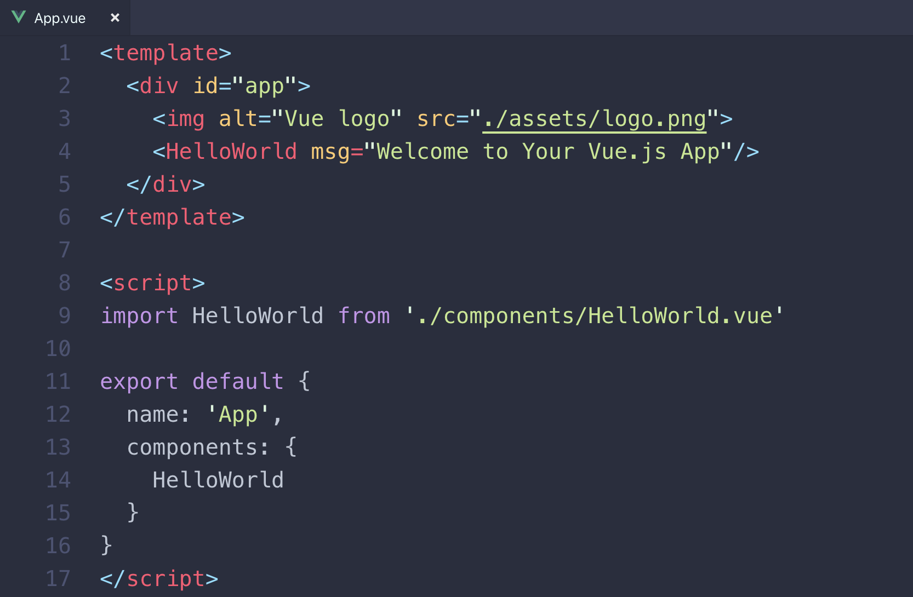
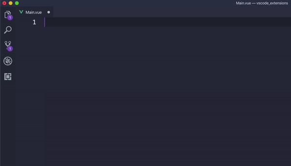

# VS Code Setting

> SSAFY에서 대여해준 노트북을 반납하게 되면서 새로운 노트북을 구매하였고, 환경설정을 하게 되었다. 우선 가장 자주 사용하고 있는 VS Code를 먼저 세팅 하려고 한다.

## 설치

설치의 경우, SSAFY 1학기 때의 설치 문서를 참조하기로 했다.

https://www.notion.so/VS-Code-28e3c9641d1c4a88b06251e9c53f8a0c

## 추가 Extension 설치

#### Python

#### ESLint

JavaScript, JSX의 정적 분석 도구로 오픈 소스 프로젝트.

코드를 분석해 문법적인 오류나 안티 패턴을 찾아주고 일관된 코드 스타일로 작성하도록 도와준다.

#### EditConfig

#### Vetur

vue 파일의 코드 하이라이팅을 위해 사용. 아래 사진은 vetur 설치 전, 후의 사진

#### vue

#### vscode-icons

폴더 및 파일 아이콘 변경

#### Vue VSCode Snippets

.vue 파일 초기 구성 생성. template, script, style로 구성된 초기 구성을 만들어 준다.

#### Prettier

https://thinkground.studio/visual-studio-code-%EC%9C%A0%EC%9A%A9%ED%95%9C-%EA%B8%B0%EB%8A%A5-prettier/